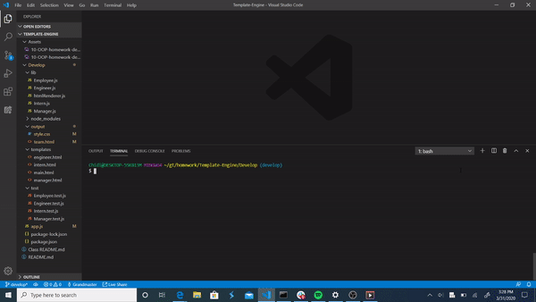

# Template-Engine
The Template Engine is a CLI that dynamically builds a webpage depending on the data entered by the user. The webpage created by the CLI will contain the data for a team the user wishes to use. This app will thus allow users to build a webpage detailing the members of their team with a few inputs to the command line.

## Installation
This app requires the inquirer package from Node.js to run properly, so inquirer must be installed. It also uses built-in packages of Node like fs and path. It must be run from the command line by entering: "node app.js".

## Usage
Once the app has begun running, the user will be prompted to enter the number of people on his/her team. A team generated by this app must contain one manager, and any number of engineers and/or interns. Once the number of engineers and interns has been entered, the app prompts the user to enter data about each member of the team in a particular format. Once this is done, the app generates a html file in the 'output' folder containing the information on each member of the team, which the user can then display on a webpage.

## Demonstration
The following animation shows a demonstration of the application functionality: 
